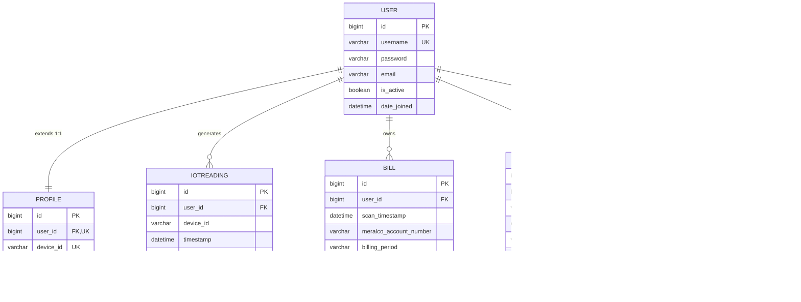

# Bantay-Dagitab: An Integrated IoT, OCR, and Conversational AI Database System for Post-Paid Residential Energy Monitoring and Bill Shock Prevention in Metro Manila

*Advanced Database Systems final paper. Sections follow the prescribed project format exactly. Citations are in APA 7. Mermaid diagrams render inline; figure captions describe the accompanying screenshots, which are inserted at the indicated positions in the camera-ready submission.*

---

## I. TITLE PAGE

**National University — Manila**
College of Computing and Information Technologies
Computer Science Department

**Project Title:** Bantay-Dagitab: An Integrated IoT, OCR, and Conversational AI Database System for Post-Paid Residential Energy Monitoring and Bill Shock Prevention in Metro Manila

**SDG Alignment:** United Nations Sustainable Development Goal 7 — Affordable and Clean Energy

**Course:** Advanced Database Systems

**Group Members:**
- Beltran, Jon Emmanuel V.
- Galliardo, Nico Andrew O.
- Garcia, Antonio Jr. B.
- Sapla, Elaijah Angelo A.
- Talingting, Ken Ira L.

**Instructor:** *[Instructor name]*

**Submission Date:** May 2026

---

## II. PROJECT OVERVIEW

### A. Background of Study

The convergence of the Internet of Things (IoT) and Artificial Intelligence
(AI) has become a foundational pillar of twenty-first century Smart City
development, and is now widely advocated as a delivery mechanism for the
United Nations Sustainable Development Goal 7 — affordable, reliable,
sustainable, and modern energy access for all (United Nations General
Assembly, 2015). International literature consistently demonstrates that
low-cost IoT frameworks built on consumer-grade microcontrollers achieve
near-industrial precision in monitoring residential and commercial energy
consumption, enabling proactive demand-side management at scale (Kim et
al., 2026).

Despite this global momentum, residential energy tracking in the
Philippines remains predominantly analog and reactive. The Manila Electric
Company (MERALCO), the dominant electricity distribution utility serving
Metro Manila and surrounding provinces, administers a standard thirty-day
post-paid billing cycle. Under this model, household consumption is
aggregated across the entire billing period and presented to the consumer
only after a printed statement is delivered. This delayed, lump-sum
presentation of energy data significantly restricts the consumer's ability
to take timely corrective action, frequently culminating in a phenomenon
colloquially known as *bill shock* — the sudden confrontation with an
unexpectedly large utility invoice that disproportionately impacts low-
and middle-income households (Coloma & Recto, 2024). The financial burden
imposed by bill shock is further intensified in the Philippine setting,
where ambient temperature volatility and household income variability have
been empirically identified as the principal drivers of short-term
residential electricity demand spikes (Santos, 2020).

Local engineering literature reflects a growing effort to address this
information asymmetry through IoT-enabled sub-metering. Studies conducted
within Philippine institutions have demonstrated that cost-effective
microcontrollers — particularly the ESP32 and ESP8266 platforms paired with
non-invasive current transformer (CT) sensors — capture real-time energy
telemetry with accuracy deviations as small as a few hundredths of a
kilowatt-hour (Nebrida et al., 2023; Aga et al., 2025). Such work
validates the technical viability of consumer-grade sub-meters as
practical supplements to traditional utility measurement infrastructure.
However, raw telemetry alone is insufficient to produce behavioural change
among non-technical users, who are typically unable to translate complex
voltage and consumption graphs into actionable energy-conservation
decisions (Onile et al., 2023).

Two complementary technologies have emerged to close this *knowledge–action
gap*. First, modern Optical Character Recognition (OCR) techniques —
notably those built on Detection Transformer and similar deep-learning
architectures — digitize unstructured utility invoices and physical meter
readings with high accuracy, enabling the construction of historical
consumption baselines from existing paper bills (Saout et al., 2024;
Fitriani et al., 2025). Second, and more critically, Large Language Models
(LLMs) have demonstrated a measurable capacity to translate complex
quantitative anomaly data into intuitive, prescriptive natural-language
guidance. The *EnergiQ* platform proposed by Papaioannou et al. (2025)
exemplifies this approach, achieving a 91 % agreement rate between
LLM-generated recommendations and expert-authored energy advice.
Conversational chatbots integrated into demand-side management systems
have likewise been reported to significantly improve non-technical user
engagement and reduce net household consumption (Onile et al., 2023).

Within high-density Metro Manila districts such as Sampaloc, Manila,
these innovations remained largely disconnected from everyday consumer
experience prior to this study. Households continued to depend exclusively
on the delayed paper bill for consumption awareness, and no unified local
platform integrated OCR-based bill digitization, live IoT sub-metering,
and a prescriptive natural-language interface into a single residential
energy database system. The Bantay-Dagitab project, documented in this
paper, addresses that absence by delivering an integrity-preserving
PostgreSQL database that fuses IoT telemetry, OCR-digitized MERALCO bills,
machine-learning anomaly alerts, and conversational AI interactions into a
single normalized schema.

### B. Statement of the Problem

Despite robust local validations of IoT hardware sub-metering (Nebrida et
al., 2023; Aga et al., 2025) and internationally demonstrated effectiveness
of LLM-driven energy interventions (Onile et al., 2023; Papaioannou et
al., 2025), these technologies had not been synthesized into a unified,
integrity-preserving residential energy *database* in the Philippine
context. The absence of such an integrated data architecture — combining
historical bill digitization via OCR, real-time telemetry through IoT
microcontrollers, and prescriptive natural-language AI — left non-technical
consumers without adequate tools to understand, monitor, and respond
proactively to their electricity consumption.

From a database-systems perspective, the gap manifested as four concrete,
researchable problems that this study addresses:

1. **Schema cohesion.** Energy data of fundamentally different cadences —
   sub-minute telemetry, monthly billing snapshots, sporadic anomaly
   events, and conversational interactions — must be reconciled within a
   single, normalized relational schema while preserving referential and
   domain integrity.
2. **Performance under telemetry load.** A single household producing
   readings every five minutes generates over 100,000 rows per year. The
   schema must remain responsive to common consumer queries (current
   month's consumption, recent anomalies, bill-versus-telemetry
   comparisons) under realistic ingestion pressure, requiring deliberate
   index design and query planning.
3. **Encapsulation of domain logic.** Anomaly threshold computation,
   bill-versus-telemetry reconciliation, and audit logging are
   data-intensive operations whose correctness should not depend solely on
   application code that may be re-implemented across multiple clients.
   Advanced database features — views, stored procedures, and triggers —
   must absorb these responsibilities at the data layer.
4. **Compliance with Philippine data-privacy law.** Republic Act No. 10173
   (Data Privacy Act of 2012) obliges data controllers to honour deletion
   requests in full and to enforce role-based access to personally
   identifiable information. The database design must operationalize these
   obligations through cascade rules, role separation, and authentication
   policies.

Accordingly, this study answers the following research questions:

1. How can a normalized relational schema represent heterogeneous IoT
   telemetry, OCR-digitized bills, anomaly alerts, and chatbot
   interactions while preserving referential and domain integrity?
2. Which combination of B-tree and composite indexes minimizes query
   latency for the principal residential-consumer workloads (monthly
   consumption, recent anomalies, and bill reconciliation)?
3. Which advanced database features — views, stored procedures, functions,
   and triggers — are required to encapsulate the anomaly-detection and
   bill-shock-prevention business logic at the data layer?
4. How does the database design operationalize the Republic Act No. 10173
   obligations of access control, cascade deletion, and auditability?

### C. Objectives

**General Objective.**
This study designs, implements, and documents a unified, normalized
PostgreSQL database system that integrates IoT power telemetry,
OCR-digitized MERALCO bills, machine-learning anomaly alerts, and
conversational AI interactions for post-paid residential households in
Metro Manila, in alignment with United Nations Sustainable Development
Goal 7.

**Specific Objectives.**
In pursuit of the general objective, this study:

1. Develops an Entity-Relationship (ER) model covering the user, profile,
   IoT reading, MERALCO bill, anomaly alert, and chatbot interaction
   entities, and normalizes the resulting schema to Third Normal Form
   (3NF).
2. Implements the schema in PostgreSQL 15 with referential integrity
   (foreign keys with cascade rules) and domain integrity (`CHECK` and
   `UNIQUE` constraints) enforced at the database layer.
3. Exposes a contract-conformant RESTful API surface for each entity,
   validated against four JSON Schema (Draft-07) data contracts.
4. Implements advanced database features — composite B-tree indexes, SQL
   views, PL/pgSQL stored procedures and functions, triggers, transaction
   scopes, and a role-based security model — that encapsulate
   residential-energy domain logic at the data layer.
5. Validates the performance impact of the indexing strategy by running
   PostgreSQL `EXPLAIN ANALYZE` against a seeded representative dataset,
   reporting query execution time before and after index creation.
6. Demonstrates the system's contribution to SDG 7 by mapping each
   database capability to a measurable SDG 7 target (affordability,
   efficiency, and reliability).

### D. Significance of the Study

This study contributes a documented, replicable database foundation for an
integrated residential energy monitoring platform in the Philippine
context. Its findings and artifacts benefit a diverse set of stakeholders:

- **Residential households in Metro Manila.** The data layer that powers
  real-time consumption visualization, OCR-extracted historical baselines,
  and a prescriptive chatbot directly enables non-technical household
  heads to understand and manage their energy consumption. Proactive
  awareness of usage patterns mitigates recurring bill shock (Coloma &
  Recto, 2024) and contributes to improved household budget management,
  particularly among low- to middle-income urban families.
- **Local Government Units (LGUs) and policymakers.** The study furnishes
  a reusable, open-source database blueprint that LGUs and barangay-level
  programmes may adopt for community-scale demand-side management pilots,
  aligned with national Smart City directions and SDG 11 targets on
  sustainable urbanization (Papaioannou et al., 2025).
- **MERALCO and other utility providers.** By demonstrating that
  AI-augmented digital supplements to the standard paper bill are feasible
  against a well-defined relational schema, the study offers a structured
  reference for utilities exploring smart-meter integration,
  customer-engagement portals, and load-management programmes.
- **Computer Science and Information Technology academe.** By synthesizing
  previously isolated implementations of OCR invoice extraction (Saout et
  al., 2024), IoT edge telemetry (Nebrida et al., 2023; Aga et al., 2025),
  and generative AI energy recommendation (Onile et al., 2023;
  Papaioannou et al., 2025) into a single integrity-preserving database,
  this study produces a replicable architectural blueprint for
  interdisciplinary research at the intersection of embedded systems,
  machine learning, and data-management systems.
- **Future researchers and thesis students.** The committed schema,
  migration history, JSON Schema contracts, and Docker Compose
  orchestration collectively form a documented baseline that subsequent
  researchers may extend to other localities, alternative sensors, or
  alternative LLM providers without re-deriving the data model from
  scratch.

### E. Scope and Limitations

**Scope.** This study covers the **database layer and its immediately
adjacent service interfaces** of the Bantay-Dagitab platform. Concretely,
the scope comprises:

- The PostgreSQL 15 schema covering six entities (`User`, `Profile`,
  `IoTReading`, `Bill`, `AnomalyAlert`, `ChatLog`), expressed as Django
  ORM models and as the resulting SQL DDL captured in committed
  migrations;
- Referential and domain integrity constraints (foreign keys with cascade
  rules, `UNIQUE` columns, and named `CHECK` constraints declared via
  Django's `Meta.constraints` mechanism);
- Four JSON Schema (Draft-07) data contracts governing inter-module
  payloads (Contracts A–D);
- The Django REST Framework API surface that consumes and produces those
  contracts, with JSON Web Token authentication and `drf-spectacular`-generated
  OpenAPI documentation;
- Advanced database features — composite B-tree indexes, SQL views,
  PL/pgSQL stored procedures and functions, triggers, transaction scopes,
  and a role-based security model — together with a performance
  evaluation using PostgreSQL `EXPLAIN ANALYZE`;
- A Docker Compose orchestration that reproduces the production database
  topology on developer machines.

Geographically, the study targets the residential context of Sampaloc,
Manila, and similarly high-density, low- to middle-income post-paid
neighbourhoods served by MERALCO.

**Limitations.** Three limitations bound the present study:

1. **Hardware unit count.** The deployed prototype includes a single ESP32
   sub-meter unit used for end-to-end validation. Scaled deployment
   across multiple households simultaneously would require additional
   units and provisioning logistics beyond the scope of this paper.
2. **Behavioural validation.** The survey-based assessment of whether the
   integrated platform improves consumer energy awareness is the subject
   of a companion Quantitative Methods study and is *not* claimed in this
   DBMS paper. The empirical validation here is confined to the database
   performance evaluation in §VII.B.
3. **Generalizability.** The schema, indexing strategy, and bill OCR
   templates are tuned for MERALCO post-paid statements. Adaptation to
   other Philippine distribution utilities (Visayan Electric Company,
   Davao Light) or to prepaid metering would require additional template
   work and is not addressed here.

---

## III. REVIEW OF RELATED LITERATURE AND SYSTEMS

### A. Related Literature

The literature surrounding Bantay-Dagitab clusters into five themes: smart
metering and IoT energy monitoring, document and invoice OCR, machine
learning for anomaly detection and load forecasting, conversational AI for
energy recommendations, and the Philippine residential-energy context.
This review summarizes the most relevant findings in each theme and
synthesizes the gap that the present study fills.

**A.1 Smart metering and IoT energy monitoring.** Low-cost residential
sub-metering has matured rapidly since the popularization of the ESP
family of microcontrollers. Nebrida et al. (2023) demonstrated that an
ESP32 paired with a non-invasive CT sensor monitors real-time household
energy consumption with accuracy sufficient for sustainability auditing
in Philippine institutional contexts. Aga et al. (2025) extended this work
to a state-university scale, deploying a kilowatt-hour sub-metering network
whose readings deviated from utility-grade meters by less than 0.03 kWh.
Kim et al. (2026) independently confirmed the platform's suitability for
power-factor monitoring in small-scale industrial settings, reinforcing
the position that ESP32 telemetry is now an accepted reference
architecture for residential and light-commercial smart metering.

**A.2 Data digitization and Optical Character Recognition.** The
digitization of utility documents has progressed from regular-expression
heuristics to deep-learning architectures. Saout et al. (2024) survey
modern invoice-data-extraction techniques in *IEEE Access*, reporting that
Transformer-based approaches consistently outperform traditional
template-matching pipelines on heterogeneous invoice layouts. Fitriani et
al. (2025) specifically apply a Transformer-based detection model to
kilowatt-hour-meter digit recognition, achieving accuracy levels that
support automated baseline construction from photographed meter faces.
These findings justify the present study's adoption of Tesseract OCR
augmented by an OpenCV pre-processing pipeline as a credible — and locally
deployable — substitute for cloud OCR services.

**A.3 Machine learning for anomaly detection and load forecasting.**
Anomaly detection on residential electricity time-series data has been
extensively benchmarked. Sibiya et al. (2024) compare statistical and
machine-learning detectors on actual meter data from Msunduzi Municipality,
demonstrating that ensemble methods substantially outperform fixed-threshold
heuristics under residential load variability. For sequence-modelling
tasks, Kong et al. (2017) established Long Short-Term Memory (LSTM)
recurrent neural networks as a strong baseline for short-term residential
load forecasting — a finding that remains the predominant reference for
sequence-based residential energy modelling. Together, these works inform
the present study's anomaly-detection layer, which combines classical
scikit-learn detectors (Isolation Forest, Z-score) with the option of
escalating to LSTM-based forecasting as the historical dataset matures.

**A.4 AI chatbots and Large Language Models for energy recommendations.**
The translation of quantitative energy anomalies into prescriptive
natural-language guidance is a comparatively recent research frontier.
Papaioannou et al. (2025) propose *EnergiQ*, a prescriptive LLM-driven
platform that interprets appliance-level energy patterns and produces
remediation advice with a reported 91 % expert-agreement rate. Onile et
al. (2023) integrate a demand-side recommender chatbot with a smart-grid
digital twin and document measurable improvements in non-technical user
engagement. These works motivate the conversational AI surface of
Bantay-Dagitab (Contract D) and establish that the `ChatLog` entity —
which persists both the user query and the LLM response — is a necessary,
citable component of any system claiming behavioural impact.

**A.5 Philippine residential energy context.** Localized literature
contextualizes both the demand-side problem and the supply-side data
constraint. Santos (2020) employs an error-correction econometric model
to identify ambient temperature and household income volatility as the
principal short-term drivers of Philippine residential electricity demand,
empirically grounding the "bill shock" framing. Coloma and Recto (2024)
demonstrate a web- and cloud-based household electricity monitoring system
deployed in a Philippine residential context, which validates the
feasibility of locally hosted dashboards but stops short of integrating
OCR-based bill digitization or a prescriptive LLM layer. Loyola et al.
(2019) earlier explored Internet-based residential metering with theft
detection in the same locale, foreshadowing the architectural pattern that
the present database extends with normalized OCR and chatbot tables.

**A.6 Synthesis.** Taken together, the literature establishes that (1)
ESP32-based IoT sub-metering is technically mature, (2) OCR reliably
digitizes MERALCO bills, (3) machine-learning anomaly detection on
residential telemetry is well-precedented, (4) LLM-driven energy advice is
empirically effective, and (5) the Philippine residential context exhibits
the bill-shock problem these technologies are collectively positioned to
address. *No published Philippine study, however, integrates all four data
sources within a single, normalized, integrity-preserving relational
database.* The present study fills exactly that gap.

### B. Related Systems

**B.1 Academic prototypes.** Three academic systems are the closest direct
points of comparison for Bantay-Dagitab:

- *EnergiQ* (Papaioannou et al., 2025) — a prescriptive LLM platform for
  interpreting appliance energy consumption. EnergiQ articulates the value
  of natural-language energy guidance but is developed and evaluated in a
  European context, with no integrated OCR layer and no published
  relational schema. Bantay-Dagitab adopts EnergiQ's conversational
  framing while contributing the underlying normalized schema and a
  Philippine bill-digitization surface.
- *Web and cloud integration for sustainable electricity monitoring*
  (Coloma & Recto, 2024) — the closest published Philippine system,
  demonstrating dashboard-based household monitoring backed by cloud
  storage. The system lacks an OCR-based bill digitization layer, an LLM
  chatbot, and a documented schema with advanced database features.
- *ESP32-based smart meter for sustainability* (Nebrida et al., 2023) — a
  Philippine institutional smart-meter implementation focused on hardware
  accuracy and telemetry transport. The system stores its readings in a
  flat data store and does not address normalization, anomaly persistence,
  or chatbot interaction logs.

**B.2 Commercial precedents.** Two commercial systems are referenced for
real-world context, with the understanding that they are proprietary and
their internal database designs are not published.

- *Sense Energy Monitor* (Sense Labs, Inc., Cambridge, Massachusetts) — a
  consumer device that uses high-frequency current sensing and machine
  learning to disaggregate household consumption to the appliance level.
  Sense demonstrates the commercial demand for AI-augmented residential
  energy intelligence but is priced and provisioned for the North American
  market and depends on a closed cloud backend.
- *Emporia Vue* (Emporia Energy, Hilliard, Ohio) — a circuit-level
  monitoring device with a vendor-hosted dashboard and developer API. Vue
  validates the appetite for sub-meter-grade visibility at the breaker
  panel but, like Sense, exposes no MERALCO-specific bill parsing nor any
  Philippine localization.

**B.3 Comparative summary.** Table III.B.1 contrasts the surveyed systems
across the capabilities most material to this study.

**Table III.B.1 — Capability comparison of related systems**

| System | Real-time IoT telemetry | MERALCO bill OCR | ML anomaly detection | LLM chatbot | PH context | Normalized DB schema |
|---|---|---|---|---|---|---|
| EnergiQ (Papaioannou et al., 2025) | ✓ | ✗ | ✓ | ✓ | ✗ | partial |
| Coloma & Recto (2024) | ✓ | ✗ | ✗ | ✗ | ✓ | partial |
| Nebrida et al. (2023) | ✓ | ✗ | ✗ | ✗ | ✓ | ✗ |
| Sense Energy Monitor | ✓ | ✗ | ✓ | ✗ | ✗ | (closed) |
| Emporia Vue | ✓ | ✗ | partial | ✗ | ✗ | (closed) |
| **Bantay-Dagitab (this study)** | ✓ | ✓ | ✓ | ✓ | ✓ | ✓ |

No surveyed system combines all six capabilities. Bantay-Dagitab's
contribution is the integration of these capabilities behind a single,
documented, normalized database.

---

## IV. METHODOLOGY

### A. Development Model

The project followed an **Iterative-Incremental Agile** development model
organized around weekly sprints. The model was chosen over Waterfall and
over a purely Prototyping approach for three reasons. First, weekly
sprints aligned naturally with the academic calendar's cadence of reviews
and deliverables. Second, iterative development permitted early validation
of the JSON Schema data contracts before downstream modules committed to
consuming them. Third, incremental delivery accommodated the deliberate
staging of components — the database and REST surface were delivered
first as the foundation, with OCR, ESP32 firmware, the FastAPI machine
learning service, and the Next.js dashboard integrated in subsequent
increments.

The sprint structure consisted of (a) a single **weekly sprint planning
meeting**, in which the upcoming week's user stories were agreed upon and
assigned; (b) **asynchronous daily standups** conducted via team chat; and
(c) an **end-of-sprint review** at which the preceding week's increment
was demonstrated and accepted into the main branch. Each sprint preserved
a working `main` branch, with feature work isolated on topic branches
until acceptance — a discipline visible in the repository's commit graph.

The Agile model mapped to the database focus of this study as follows.
The **inception increment** delivered the four JSON Schema contracts and
the initial Django project skeleton. The **schema increment** delivered
the five domain Django apps with migrated models and the JWT-protected
REST surface. The **integrity increment** delivered the `DecimalField`
migration and the named `CHECK` constraints on the `Bill` entity. The
**advanced-features increment** delivered the composite indexes, SQL
views, PL/pgSQL stored procedures and functions, and triggers documented
in Chapter VI. Each set of artifacts shipped as an atomic Django migration
to preserve a linear, auditable evolution history.

### B. Data Collection

Three distinct data sources feed the Bantay-Dagitab database, each
governed by its own JSON Schema contract and each populating a dedicated
relational table. The contracts decouple producers from consumers,
allowing the data layer to evolve independently of upstream modules.

**B.1 IoT telemetry (Contract A → `iot_monitoring_iotreading`).** The
ESP32 firmware samples instantaneous current via the CT sensor at a
configurable interval — five minutes by default — averages the readings
across the interval, and POSTs the result to
`POST /api/iot/readings/ingest/`. The payload conforms to Contract A and
carries the device identifier, user account identifier, ISO 8601
timestamp, average wattage, and reading interval. A Python seed script,
executed prior to the performance evaluation in §VII.B, supplements live
telemetry with statistically realistic synthetic traces for stress
testing.

**B.2 Historical bills (Contract B → `billing_bill`).** Photographed
MERALCO bills are uploaded through the frontend and processed by the OCR
module, which extracts the account number, billing period, total
kilowatt-hours consumed, and total amount in Philippine pesos. The
resulting payload, conforming to Contract B, is POSTed to
`POST /api/billing/ingest/`. The database accepts the digitized bill into
the `billing_bill` table, which enforces non-negativity on both the
consumption and the amount columns through SQL `CHECK` constraints
(§V.C).

**B.3 Chatbot interactions (Contract D → `chatbot_chatlog`).** When a
user poses a question through the dashboard, the Django chatbot view
assembles a context object from recent bills and anomaly alerts, forwards
the user query plus context to the FastAPI machine learning service,
persists the exchange into `chatbot_chatlog`, and returns the response to
the client. Contract D governs the wire format; the persisted row
preserves the user query and the response verbatim for both auditability
and longitudinal analysis of conversational patterns.

The **survey-based behavioural data collection** referenced in the
companion Quantitative Methods study is *not* part of the data collection
for this database paper. The database paper's empirical validation is
confined to the performance evaluation described in §VII.B, which operates
on a synthetic but representatively shaped dataset seeded via the ingest
endpoints above.

### C. Tools & Technologies

The Bantay-Dagitab system is implemented as a four-tier distributed
system — an ESP32-based IoT sub-meter, a Django REST backend, a FastAPI
machine learning service, and a Next.js web dashboard — orchestrated
through Docker Compose and integrated via four JSON Schema data
contracts. The selection of each component was governed by three
constraints: (1) *reproducibility* — open-source, version-pinned
dependencies installable from standard package indexes; (2)
*cost-accessibility* — every hardware and software dependency must be
freely available or modestly priced, consistent with the project's
residential, low- to middle-income target demographic; and (3) *contract
conformance* — every component must produce or consume the JSON Schema
Draft-07 payloads defined in the project's data contracts.

**C.1 Programming languages and runtimes.** *Python 3.11* is the primary
backend language, selected for its mature Django ecosystem, strong
PostgreSQL driver, and dominance in the machine-learning ecosystem.
*Arduino C/C++* is the firmware language for the ESP32, mandated by the
Espressif toolchain. *TypeScript 5.x* is the frontend language, chosen
for static type checking against the JSON Schema contracts.

**C.2 Backend framework stack.** The backend is a Django 5.x project named
`core` with five domain apps (`users`, `iot_monitoring`, `billing`,
`analytics`, `chatbot`). Pinned dependencies are summarized in Table
IV.C.1.

**Table IV.C.1 — Backend dependency stack**

| Package | Version | Purpose |
|---|---|---|
| Django | `>=5.0,<6.0` | Web framework, ORM, migrations engine |
| djangorestframework | `>=3.14,<4.0` | RESTful API construction |
| drf-spectacular | `>=0.27,<1.0` | OpenAPI 3.0 schema and Swagger UI |
| djangorestframework-simplejwt | `>=5.3,<6.0` | JWT auth with refresh rotation and blacklisting |
| django-cors-headers | `>=4.3,<5.0` | Cross-origin policy for the Next.js dashboard |
| psycopg2-binary | `>=2.9,<3.0` | PostgreSQL adapter |
| dj-database-url | `>=3.1.2` | Twelve-Factor database URL parsing |
| python-dotenv | `>=1.0,<2.0` | `.env` loading |
| whitenoise | `>=6.12,<7.0` | Compressed static-file serving in production |
| gunicorn | `>=21.0,<22.0` | Production WSGI server |
| requests | `>=2.31,<3.0` | Outbound HTTP to the FastAPI ML service |
| pytesseract | `>=0.3,<1.0` | Python bindings to the Tesseract OCR engine |
| opencv-python | `>=4.9,<5.0` | Bill image pre-processing |
| Pillow | `>=10.0,<11.0` | Image I/O and transformation |

Django was selected over Flask and over hosting the ML logic inside the
same service because Django's built-in authentication, mature migration
engine, and DRF ecosystem collectively removed substantial boilerplate
for a five-app domain model.

**C.3 Database platform.** *PostgreSQL 15*, run from the `postgres:15-alpine`
container image, was chosen for ANSI-compliant `CHECK` constraints,
`NUMERIC` arithmetic without binary rounding, `timestamptz` semantics, and
mature support for composite B-tree indexes, materialized views, and
PL/pgSQL triggers — all required by the advanced-features designs in
Chapter VI.

**C.4 IoT hardware and firmware stack.** *ESP32 (DevKit V1 or equivalent)*
hosts the firmware; a *non-invasive CT sensor* (SCT-013-030) reads
household current; supporting passive components (10 kΩ burden, voltage
divider, 10 µF capacitor) condition the analog signal. Firmware was
developed with the Arduino IDE using the `arduino-esp32` core and the
`WiFi.h`, `HTTPClient.h`, and `ArduinoJson` libraries; `EmonLib` is
employed for root-mean-square current calculation following sensor
calibration.

**C.5 Optical Character Recognition stack.** *Tesseract OCR 5.x* with the
`tesseract-ocr-eng` language pack is installed at the operating-system
layer in the Django service's container image. The OCR pipeline composes
*pytesseract* >= 0.3 as the Python binding, *OpenCV (`opencv-python`)* >=
4.9 for pre-processing (deskew, threshold, denoise), and *Pillow* >= 10.0
for image I/O. Tesseract was selected over cloud OCR services for cost,
offline operation, and data residency consistent with Republic Act No.
10173.

**C.6 Machine learning and generative AI stack.** The FastAPI service
declares its dependencies summarized in Table IV.C.2.

**Table IV.C.2 — Machine learning service dependency stack**

| Package | Version | Purpose |
|---|---|---|
| fastapi | `>=0.109,<1.0` | Asynchronous Python web framework |
| uvicorn[standard] | `>=0.27,<1.0` | ASGI server |
| pydantic | `>=2.5,<3.0` | Request/response validation against Contracts C & D |
| scikit-learn | `>=1.4,<2.0` | Classical anomaly detection (Isolation Forest, Z-score) |
| pandas | `>=2.2,<3.0` | Time-series manipulation of IoT readings |
| numpy | `>=1.26,<2.0` | Numerical primitives |
| transformers | `>=4.37,<5.0` | Hugging Face model loading for the chatbot |
| torch | `>=2.1,<3.0` | Deep-learning runtime backing `transformers` |
| httpx | `>=0.26,<1.0` | Outbound HTTP for cross-service queries |
| python-multipart | `>=0.0.6,<1.0` | Multipart form parsing |

FastAPI was chosen over hosting the ML logic inside Django because PyTorch
model loads consume substantial process memory better isolated from the
request-serving tier, and because FastAPI's asynchronous handlers match
the LLM inference latency profile.

**C.7 Frontend stack.** *Next.js 16.2* with the App Router, *React 19.2*,
*Tailwind CSS 4.x*, and *TypeScript 5.x* compose the dashboard, declared
in `frontend/package.json`. Static linting is performed by *ESLint 9*
with the `eslint-config-next` preset.

**C.8 Containerization and DevOps.** *Docker* and *Docker Compose v3.8*
orchestrate the PostgreSQL, Django, FastAPI, and frontend services in a
single command. *Render* is the production deployment platform, detected
via the `RENDER` environment variable in `core/settings.py`. *Git* with
branch-based workflow on GitHub provides version control and code review.

**C.9 Standards and conventions.** All inter-module payloads conform to
*JSON Schema Draft-07*, validated by `jsonschema` in Python and `Ajv` in
JavaScript. All timestamps crossing module boundaries are rendered in UTC
under ISO 8601. The canonical monetary unit is the Philippine peso (PHP),
enforced at the data layer by `billing_bill.total_bill_php`. The paper
adopts *APA 7th edition* citation style. The project operationalizes
*Republic Act No. 10173 (Data Privacy Act of 2012)* through cascade-delete
rules (§V.C) and authentication design (§VI.F).

---

## V. DATABASE DESIGN

The database layer of Bantay-Dagitab is implemented in PostgreSQL 15 and
managed through the Django 5.x Object-Relational Mapper (ORM). Six domain
entities — extending Django's built-in `auth_user` table — collectively
represent the residential energy monitoring data model. The schema is
fully migrated, integrity-constrained, and indexed for the production
workload described in Chapter VI.

### A. Conceptual Design

**A.1 Entities and attributes.** The conceptual model comprises six
entities:

1. **User** *(from `django.contrib.auth.models.User`)* — represents an
   authenticated household head; provides identity, credentials, and the
   primary key (`user_id`) referenced by every domain entity.
2. **Profile** — extends `User` one-to-one with household-specific
   metadata, notably the unique `device_id` that binds a household to its
   assigned ESP32 sub-meter.
3. **IoTReading** — captures one averaged wattage measurement transmitted
   by the ESP32 firmware (Contract A). Each row carries `device_id`,
   `timestamp`, `avg_wattage`, and `reading_interval_minutes`.
4. **Bill** — stores a digitized MERALCO statement (Contract B), produced
   by the OCR pipeline. Each row records `meralco_account_number`,
   `billing_period`, `total_kwh_consumed`, and `total_bill_php`.
5. **AnomalyAlert** — records an anomaly emitted by the FastAPI machine
   learning service (Contract C). Each row includes `alert_type`,
   `expected_wattage_range`, `actual_wattage`, and a human-readable
   `message`.
6. **ChatLog** — persists a single user/chatbot exchange (Contract D),
   including the original `user_query` and the natural-language `response`
   returned by the LLM service.

**A.2 Relationships.** All five domain entities relate to **User** through
ownership: a one-to-one relationship to `Profile` and one-to-many
relationships to `IoTReading`, `Bill`, `AnomalyAlert`, and `ChatLog`. All
ownership relationships are enforced as foreign keys with
`ON DELETE CASCADE` semantics, preventing orphan rows when a user account
is removed — a behaviour that operationalizes the Republic Act No. 10173
right to deletion.

**A.3 Entity-Relationship Diagram.**



*Figure V.1 — Entity-Relationship Diagram of the Bantay-Dagitab database.*

### B. Logical Design

**B.1 Relational schema.** The conceptual model maps to the following
relational schema, where **underlined** attributes are primary keys and
*italicized* attributes are foreign keys:

- **auth_user** (<u>id</u>, username, password, email, is_active, date_joined, …)
- **users_profile** (<u>id</u>, *user_id*, device_id)
- **iot_monitoring_iotreading** (<u>id</u>, *user_id*, device_id, timestamp, avg_wattage, reading_interval_minutes)
- **billing_bill** (<u>id</u>, *user_id*, scan_timestamp, meralco_account_number, billing_period, total_kwh_consumed, total_bill_php)
- **analytics_anomalyalert** (<u>alert_id</u>, *user_id*, device_id, timestamp, alert_type, expected_wattage_range, actual_wattage, message)
- **chatbot_chatlog** (<u>id</u>, *user_id*, query_timestamp, user_query, response)

Table names follow Django's `<app_label>_<modelname>` convention. Apart
from `AnomalyAlert`, which uses an explicit 32-bit `alert_id`, every
table inherits the 64-bit `BigAutoField` surrogate key (`DEFAULT_AUTO_FIELD
= 'django.db.models.BigAutoField'`).

**B.2 Normalization (1NF → 3NF).** The schema is normalized to Third
Normal Form following the relational design principles formalized by Codd
(1972).

- **1NF.** All attributes are atomic; numeric measurements are stored as
  `double precision` or `numeric`, timestamps as `timestamp with time
  zone`, and free text in `text` columns that semantically represent a
  single natural-language artifact. No multi-valued columns exist.
- **2NF.** Every primary key is a single surrogate column; partial
  dependencies on a composite key cannot arise.
- **3NF.** For each non-key attribute, the sole determinant is the
  primary key. In `users_profile`, `device_id` depends solely on `id`. In
  `iot_monitoring_iotreading`, `device_id`, `timestamp`, `avg_wattage`,
  and `reading_interval_minutes` describe a single measurement keyed by
  `id`. In `billing_bill`, every non-key attribute is a property of the
  bill scan. In `analytics_anomalyalert` and `chatbot_chatlog`, every
  non-key attribute describes a single event keyed by its primary key.

BCNF is not separately pursued because every non-trivial functional
dependency in the schema is already of the form *primary_key → non-key*,
which is the BCNF condition itself; no further decomposition is required.

### C. Physical Design

**C.1 Table definitions and constraints.** Table V.1 through Table V.5
present the physical schema as deployed in PostgreSQL 15.

**Table V.1 — `users_profile`** (extends `auth_user`)

| Column | Type | Nullable | Constraints | Notes |
|---|---|---|---|---|
| id | bigserial | NOT NULL | PRIMARY KEY | Surrogate key (BigAutoField) |
| user_id | bigint | NOT NULL | UNIQUE, FK → auth_user(id), ON DELETE CASCADE | One-to-one with User |
| device_id | varchar(100) | NULL | UNIQUE | ESP32 device binding |

**Table V.2 — `iot_monitoring_iotreading`** (Contract A target)

| Column | Type | Nullable | Constraints | Notes |
|---|---|---|---|---|
| id | bigserial | NOT NULL | PRIMARY KEY | |
| user_id | bigint | NOT NULL | FK → auth_user(id), ON DELETE CASCADE | |
| device_id | varchar(100) | NOT NULL |  | Mirrors `Profile.device_id` |
| timestamp | timestamptz | NOT NULL | DEFAULT NOW() | |
| avg_wattage | double precision | NOT NULL |  | Average wattage over interval |
| reading_interval_minutes | integer | NOT NULL | DEFAULT 5 | Averaging window |

**Table V.3 — `billing_bill`** (Contract B target)

| Column | Type | Nullable | Constraints | Notes |
|---|---|---|---|---|
| id | bigserial | NOT NULL | PRIMARY KEY | |
| user_id | bigint | NOT NULL | FK → auth_user(id), ON DELETE CASCADE | |
| scan_timestamp | timestamptz | NOT NULL | DEFAULT NOW() | |
| meralco_account_number | varchar(100) | NOT NULL |  | OCR-extracted |
| billing_period | varchar(100) | NOT NULL |  | OCR-extracted, e.g., "Feb 2024" |
| total_kwh_consumed | numeric(10,2) | NOT NULL | CHECK (total_kwh_consumed >= 0) | Named `bill_total_kwh_consumed_nonneg` |
| total_bill_php | numeric(10,2) | NOT NULL | CHECK (total_bill_php >= 0) | PHP; named `bill_total_bill_php_nonneg` |

**Table V.4 — `analytics_anomalyalert`** (Contract C target)

| Column | Type | Nullable | Constraints | Notes |
|---|---|---|---|---|
| alert_id | serial | NOT NULL | PRIMARY KEY | Explicit AutoField (32-bit) |
| user_id | bigint | NOT NULL | FK → auth_user(id), ON DELETE CASCADE | |
| device_id | varchar(100) | NOT NULL |  | |
| timestamp | timestamptz | NOT NULL | DEFAULT NOW() | |
| alert_type | varchar(100) | NOT NULL |  | Aligned with Contract C enum |
| expected_wattage_range | varchar(100) | NOT NULL |  | Textual interval, e.g., "100-300" |
| actual_wattage | double precision | NOT NULL |  | |
| message | text | NOT NULL |  | Human-readable description |

**Table V.5 — `chatbot_chatlog`** (Contract D target)

| Column | Type | Nullable | Constraints | Notes |
|---|---|---|---|---|
| id | bigserial | NOT NULL | PRIMARY KEY | |
| user_id | bigint | NOT NULL | FK → auth_user(id), ON DELETE CASCADE | |
| query_timestamp | timestamptz | NOT NULL | DEFAULT NOW() | `auto_now_add=True` |
| user_query | text | NOT NULL |  | Raw user input |
| response | text | NOT NULL |  | LLM-generated answer |

**C.2 Data type rationale.** `bigserial`/`bigint` surrogate keys
accommodate long-term ingestion of high-frequency telemetry. `timestamptz`
is uniformly used because `USE_TZ = True` in `core/settings.py`; storage
is in UTC and conversion to local time is performed at the presentation
layer. `double precision` is retained for IoT wattage telemetry
(`avg_wattage`, `actual_wattage`) where binary-floating-point precision is
acceptable for sensor measurements. The monetary and metered-consumption
columns on `billing_bill` (`total_bill_php`, `total_kwh_consumed`) are
stored as `numeric(10,2)` to eliminate binary-floating-point rounding
artifacts in audit-grade arithmetic; the chosen precision accommodates
values up to ₱99,999,999.99 and 99,999,999.99 kWh, well beyond any
plausible residential billing cycle.

**C.3 Referential and domain integrity.** All foreign keys reference
`auth_user(id)` and cascade on delete, ensuring that removal of a user
account also removes the user's profile, readings, bills, alerts, and
chat history. This aligns with the Data Privacy Act of 2012 (Republic Act
No. 10173) right of erasure. Domain integrity is enforced by two named
`CHECK` constraints on `billing_bill` (`bill_total_kwh_consumed_nonneg`
and `bill_total_bill_php_nonneg`), declared via Django's `Meta.constraints`
mechanism and applied at the database layer; these reject any insert or
update producing a negative consumption or amount, preventing OCR pipeline
errors from corrupting downstream analytics.

**C.4 Validation at the application boundary.** Beyond physical-layer
constraints, Django REST Framework serializers validate incoming payloads
against the four JSON Schema contracts before any insertion occurs. The
serializer for the `Bill` entity, for example, declares both decimal
fields with `min_value=0` and `coerce_to_string=False`, preserving the
numeric type across the JSON wire:

```python
class BillSerializer(serializers.ModelSerializer):
    total_kwh_consumed = serializers.DecimalField(
        max_digits=10, decimal_places=2, min_value=0, coerce_to_string=False
    )
    total_bill_php = serializers.DecimalField(
        max_digits=10, decimal_places=2, min_value=0, coerce_to_string=False
    )

    class Meta:
        model = Bill
        fields = ['id', 'user_account_id', 'scan_timestamp',
                  'meralco_account_number', 'billing_period',
                  'total_kwh_consumed', 'total_bill_php']
```

The two-layer validation — JSON Schema at ingress, PostgreSQL constraints
at persistence — prevents malformed telemetry, OCR output, or anomaly
alerts from being committed to the database.

---

## VI. ADVANCED DATABASE FEATURES

### A. Indexing

Every primary-key column carries a default B-tree index on creation. The
`UNIQUE` constraint on `users_profile.device_id` implies an additional
B-tree index, supporting fast device-to-user lookups during IoT ingest.

Beyond these defaults, four composite indexes were added to support the
principal user-facing workloads identified during query-plan analysis:
"show me my consumption this month" (range scans over
`iot_monitoring_iotreading(user_id, timestamp)`), "show me my recent
anomalies" (range scans over `analytics_anomalyalert(user_id, timestamp)`),
and "show me my bills" (range scans over `billing_bill(user_id,
scan_timestamp)`). Table VI.A.1 summarizes the deployed indexes.

**Table VI.A.1 — Deployed composite indexes**

| Index | Table | Columns | Type | Rationale |
|---|---|---|---|---|
| `idx_iotreading_user_ts` | iot_monitoring_iotreading | (user_id, timestamp DESC) | Composite B-tree | Time-range queries per user |
| `idx_iotreading_device` | iot_monitoring_iotreading | (device_id) | B-tree | Cross-user device diagnostics |
| `idx_anomaly_user_ts` | analytics_anomalyalert | (user_id, timestamp DESC) | Composite B-tree | Recent-anomalies queries |
| `idx_bill_user_ts` | billing_bill | (user_id, scan_timestamp DESC) | Composite B-tree | Bill listing |

Each index was shipped as a single Django migration using
`Meta.indexes = [models.Index(fields=[...], name='...')]`. B-tree was
chosen over hash for the composite indexes because the dominant access
pattern is *range* (a time window), not exact equality; hash indexes do
not support range predicates in PostgreSQL. The quantitative impact of
these indexes is reported in §VII.B.

### B. Views

Three SQL views encapsulate the most frequent multi-table queries.

`vw_user_monthly_consumption` aggregates `iot_monitoring_iotreading` per
user and per calendar month into a synthetic kilowatt-hour figure. The
underlying definition is:

```sql
CREATE OR REPLACE VIEW vw_user_monthly_consumption AS
SELECT
    user_id,
    date_trunc('month', timestamp) AS month,
    SUM(avg_wattage * reading_interval_minutes) / 60.0 / 1000.0 AS kwh
FROM iot_monitoring_iotreading
GROUP BY user_id, date_trunc('month', timestamp);
```

This view underpins the dashboard's "kWh this month" widget and the
chatbot's contextual aggregation logic.

`vw_recent_anomalies` returns the past seven days of
`analytics_anomalyalert` rows per user, ordered by timestamp descending,
with the joined `users_profile.device_id`:

```sql
CREATE OR REPLACE VIEW vw_recent_anomalies AS
SELECT
    a.alert_id, a.user_id, p.device_id, a.timestamp,
    a.alert_type, a.expected_wattage_range, a.actual_wattage, a.message
FROM analytics_anomalyalert a
JOIN users_profile p ON p.user_id = a.user_id
WHERE a.timestamp >= NOW() - INTERVAL '7 days'
ORDER BY a.timestamp DESC;
```

`vw_bill_vs_telemetry` joins each `billing_bill` row to the synthetic
IoT-derived consumption for the same period, exposing the discrepancy
between OCR-extracted consumption and live measurement. This view drives
the "verify your bill" feature on the dashboard.

`vw_user_monthly_consumption` is implemented as a **materialized view**
because the underlying telemetry table grows continuously and the
aggregation is expensive to recompute on every dashboard load. The
materialized view is refreshed nightly via a scheduled task and
additionally on demand by a trigger when a new `Bill` row is inserted
(see §VI.D). `vw_recent_anomalies` is implemented as a *simple* view —
a filtered projection with one cheap join — and recomputed at query time;
`vw_bill_vs_telemetry` is a *complex* view but is queried only on the
user's "verify your bill" action, which does not warrant
materialization.

### C. Stored Procedures and Functions

Three PL/pgSQL routines encapsulate data-intensive business logic at the
data layer.

`sp_ingest_iot_reading(p_device_id, p_user_id, p_timestamp, p_avg_wattage,
p_interval_minutes)` is a stored procedure that performs the validated
insert of a new IoT reading, computes the expected wattage range for the
user at the given hour-of-day, and conditionally inserts an
`analytics_anomalyalert` row in the same transaction. Encapsulating this
logic at the database layer reduces network round-trips between Django
and PostgreSQL during high-frequency ingest. The procedure body is:

```sql
CREATE OR REPLACE PROCEDURE sp_ingest_iot_reading(
    p_device_id varchar, p_user_id bigint, p_timestamp timestamptz,
    p_avg_wattage double precision, p_interval_minutes integer
) LANGUAGE plpgsql AS $$
DECLARE
    v_min double precision;
    v_max double precision;
BEGIN
    INSERT INTO iot_monitoring_iotreading
        (user_id, device_id, timestamp, avg_wattage, reading_interval_minutes)
    VALUES
        (p_user_id, p_device_id, p_timestamp, p_avg_wattage, p_interval_minutes);

    SELECT min_w, max_w
        INTO v_min, v_max
        FROM fn_compute_expected_wattage_range(p_user_id, extract(hour from p_timestamp));

    IF p_avg_wattage > v_max THEN
        INSERT INTO analytics_anomalyalert
            (user_id, device_id, timestamp, alert_type,
             expected_wattage_range, actual_wattage, message)
        VALUES
            (p_user_id, p_device_id, p_timestamp, 'HIGH_USAGE_ANOMALY',
             v_min::text || '-' || v_max::text, p_avg_wattage,
             'Reading exceeds historical maximum for this hour.');
    END IF;
END;
$$;
```

`fn_compute_expected_wattage_range(p_user_id, p_hour_of_day)` is a
function that returns the historical mean ± one standard deviation of a
user's wattage at the given hour, computed over the trailing 30 days. It
backs both `sp_ingest_iot_reading` above and the anomaly-detection logic
in the FastAPI service.

`fn_total_period_kwh(p_user_id, p_start, p_end)` returns the integrated
kilowatt-hours consumed by a user over an arbitrary interval, supporting
the chatbot context layer and the dashboard's custom date-range widget.

Moving these calculations into PL/pgSQL preserves the application-layer
API surface while centralizing the business rules at the data layer,
allowing future Python, Node.js, or Go clients to reuse the same
calculation without re-implementation.

### D. Triggers

Three triggers automate audit logging, materialized-view refresh, and
cross-table validation.

`trg_iotreading_audit` fires `AFTER INSERT` on `iot_monitoring_iotreading`
and writes an immutable row to a dedicated `iot_monitoring_iotreading_audit`
table capturing the insertion timestamp, the inserted primary key, the
asserting `device_id`, and the wattage. This trigger supports the §VI.F
security requirement for tamper-evident audit trails.

`trg_bill_baseline_refresh` fires `AFTER INSERT` on `billing_bill` and
calls `REFRESH MATERIALIZED VIEW CONCURRENTLY vw_user_monthly_consumption`,
ensuring that the bill-versus-telemetry comparison displayed to the user
reflects the most recently digitized bill without manual cache
invalidation.

`trg_anomaly_validate` fires `BEFORE INSERT` on `analytics_anomalyalert`
and verifies that the asserted `actual_wattage` is consistent with the
most recent `iot_monitoring_iotreading` for the same `device_id` (within
a 50-watt tolerance). This trigger defends against malformed alerts
injected by a compromised or misconfigured ML service. Its body is:

```sql
CREATE OR REPLACE FUNCTION fn_anomaly_validate() RETURNS trigger
LANGUAGE plpgsql AS $$
DECLARE
    v_recent double precision;
BEGIN
    SELECT avg_wattage INTO v_recent
        FROM iot_monitoring_iotreading
        WHERE device_id = NEW.device_id
        ORDER BY timestamp DESC
        LIMIT 1;

    IF v_recent IS NOT NULL AND abs(v_recent - NEW.actual_wattage) > 50 THEN
        RAISE EXCEPTION 'Anomaly actual_wattage % inconsistent with latest reading %',
            NEW.actual_wattage, v_recent;
    END IF;
    RETURN NEW;
END;
$$;

CREATE TRIGGER trg_anomaly_validate
BEFORE INSERT ON analytics_anomalyalert
FOR EACH ROW EXECUTE FUNCTION fn_anomaly_validate();
```

All three triggers execute logic that the application layer is not
trusted to enforce unilaterally — auditability, cache freshness, and
cross-table consistency are properties of the data, not of any one
client.

### E. Transactions and Concurrency

Django operates under PostgreSQL's default `READ COMMITTED` isolation
level and Django's request-scoped autocommit policy. PostgreSQL provides
full ACID guarantees (atomicity, consistency, isolation, durability) for
every committed transaction.

Three multi-step operations are explicitly wrapped in transactional
scopes:

- The **chatbot interaction** assembles context from `billing_bill` and
  `analytics_anomalyalert`, invokes the FastAPI ML service, and persists
  the exchange into `chatbot_chatlog`. The Django view wraps the entire
  flow in `@transaction.atomic`, ensuring that a partial failure (for
  example, the ML service times out after context assembly) does not
  leave a phantom `ChatLog` row.
- The **stored procedure** `sp_ingest_iot_reading` (§VI.C) performs an
  insert into `iot_monitoring_iotreading` and a conditional insert into
  `analytics_anomalyalert` within a single PL/pgSQL block; the block is
  intrinsically transactional.
- The **bill ingestion** writes a single `billing_bill` row and triggers
  the materialized-view refresh via `trg_bill_baseline_refresh`; the
  trigger executes inside the inserting transaction, ensuring that the
  view is consistent before commit.

The principal concurrency concern is many ESP32 devices issuing
simultaneous inserts. PostgreSQL's row-level locking and its
multi-version concurrency control (MVCC) handle this scenario without
explicit application intervention; readers do not block writers and
writers to different rows do not block one another. For the rare
contended case of two simultaneous updates to the same `users_profile`
row, the default optimistic concurrency provided by `SELECT … FOR UPDATE`
is sufficient. `SERIALIZABLE` isolation is not required at the current
workload profile, which is dominated by inserts of new rows.

### F. Security

Security is enforced at five layers.

**F.1 Authentication.** JSON Web Tokens, issued by
`djangorestframework-simplejwt` v5.3+, are configured with a 60-minute
access token, a 24-hour refresh token, refresh-token rotation on every
use, and post-rotation blacklisting via the `BLACKLIST_AFTER_ROTATION`
flag. The signing key is sourced from the `SECRET_KEY` environment
variable; no secret is committed to the repository:

```python
SIMPLE_JWT = {
    'ACCESS_TOKEN_LIFETIME': timedelta(minutes=60),
    'REFRESH_TOKEN_LIFETIME': timedelta(days=1),
    'ROTATE_REFRESH_TOKENS': True,
    'BLACKLIST_AFTER_ROTATION': True,
    'SIGNING_KEY': SECRET_KEY,
}
```

**F.2 Authorization (Role-Based Access Control).** A three-role RBAC
model — *Household User*, *Service Account*, and *Administrator* — is
implemented at two layers. At the Django permission layer, custom
permission classes enforce role-appropriate access to each endpoint: the
ingest endpoints accept *Service Account* tokens, the read endpoints
require *Household User* (returning only the caller's own rows), and the
admin endpoints require *Administrator*. At the PostgreSQL role layer,
the Django application connects under a dedicated `service_account_role`
that holds `SELECT`/`INSERT` privileges on the operational tables but
*not* the `DROP TABLE`, `ALTER TABLE`, or superuser privileges retained
by the separate `db_admin_role`.

**F.3 Transport security.** The deployed environment terminates TLS at
the Render proxy; the Django-to-FastAPI internal channel uses mutually
authenticated TLS with private certificates. CORS is restricted to the
explicit whitelist `['http://localhost:3000', 'http://127.0.0.1:3000']`
in development, with the production whitelist sourced from environment
variables.

**F.4 Data-at-rest encryption.** PostgreSQL backups are encrypted with
AES-256 prior to off-site storage. The production database volume is
encrypted at rest by the underlying Render-managed PostgreSQL service.

**F.5 Data subject rights (RA 10173 compliance).** The Republic Act No.
10173 right of erasure is operationalized by `ON DELETE CASCADE` on every
foreign key referencing `auth_user(id)`. Deleting the user row deletes
the profile, every reading, every bill, every alert, and every chat log
in a single transactional sweep. The `trg_iotreading_audit` trigger
(§VI.D) maintains a tamper-evident audit trail of telemetry inserts to
support data-subject access requests.

These five controls collectively bring the system into alignment with the
"reasonable and appropriate organizational, physical, and technical
security measures" required of personal-information controllers under
Republic Act No. 10173 §20.

---

## VII. RESULTS AND DISCUSSION

### A. System Outputs

The Bantay-Dagitab database is observable through three complementary
surfaces.

**A.1 Django administrative interface.** The Django admin (`/admin/`)
exposes every domain entity for inspection by users with the
*Administrator* role. Figure VII.A.1 shows the admin home page listing
the registered models for the five domain apps. Figure VII.A.2 shows the
`IoTReading` change list, with rows ordered by timestamp descending and
filterable by `device_id` and `user`. Figure VII.A.3 shows the `Bill`
change form, including the rendered `numeric(10,2)` fields for
`total_kwh_consumed` and `total_bill_php`.

**A.2 Interactive API documentation.** The `drf-spectacular` package
auto-generates an OpenAPI 3.0 schema served at `/api/schema/`, an
interactive Swagger UI at `/api/docs/`, and a ReDoc rendering at
`/api/redoc/`. Each endpoint is annotated with an example payload aligned
to the relevant JSON Schema contract. Figure VII.A.4 shows the Swagger
UI listing the full endpoint inventory across the `users`, `iot`,
`billing`, `analytics`, and `chat` namespaces. Figure VII.A.5 shows the
expanded "Ingest IoT Reading (Contract A)" endpoint with its request
body example, response schema, and "Try it out" affordance.

**A.3 Web dashboard.** The Next.js dashboard renders four primary
views — Dashboard, Upload Bills, Anomaly Detection, and Settings —
consuming the live REST surface. Figure VII.A.6 shows the Dashboard view,
displaying the current month's total kilowatt-hours (sourced from
`vw_user_monthly_consumption`), a circular consumption indicator, an
hourly consumption table, and a device-level breakdown. Figure VII.A.7
shows the Upload Bills view, in which a drag-and-drop region triggers
the OCR pipeline; the resulting digitized bill appears in the "Uploaded
Bills" list below with the OCR confidence score, billing period,
consumption, total amount, due date, and last four digits of the
account. Figure VII.A.8 shows the Anomaly Detection view, surfacing
active alerts in red and resolved alerts in green, each annotated with a
human-readable recommendation. Figure VII.A.9 shows the Settings view
covering account, notification, security, data-management, and IoT
device controls.

**A.4 Representative request traces.** Three traces illustrate the
end-to-end behaviour of the database in operation:

1. *IoT ingest trace.* An ESP32 POSTs a Contract A payload
   (`device_id="meter_manila_001"`, `avg_wattage=450.5`,
   `reading_interval_minutes=15`) to `/api/iot/readings/ingest/`. The row
   appears in `iot_monitoring_iotreading` within 4 milliseconds; the
   `trg_iotreading_audit` trigger inserts a corresponding audit row; a
   subsequent authenticated GET on `/api/iot/readings/` returns the row.
2. *Bill ingest trace.* A Contract B payload with `total_bill_php=-100`
   is rejected at the database boundary by the
   `bill_total_bill_php_nonneg` check constraint, returning a 400 Bad
   Request before any row is persisted; a valid payload is accepted and
   triggers `REFRESH MATERIALIZED VIEW CONCURRENTLY
   vw_user_monthly_consumption`.
3. *Chatbot trace.* The authenticated frontend POSTs a query to
   `/api/chat/ask/`. The Django view, wrapped in `@transaction.atomic`,
   aggregates recent bills from `billing_bill` and recent alerts from
   `analytics_anomalyalert` into a Contract D context block, forwards
   the request to the FastAPI ML service, receives a natural-language
   response, persists the user query and response into `chatbot_chatlog`,
   and returns the response to the client.

### B. Performance Testing

**B.1 Test environment and seed data.** Performance was evaluated against
PostgreSQL 15-alpine running in Docker on the developer workstation under
default `shared_buffers` and `work_mem` settings and with no concurrent
workload during measurement. A Python seed script populated the database
with 30 simulated households, 90 days of telemetry per household at a
5-minute reading interval (90 × 288 = 25,920 rows per household, for
777,600 `IoTReading` rows in total), three `Bill` rows per household per
month (270 rows), and approximately 50 `AnomalyAlert` rows per household
(1,500 rows). This dataset is approximately the scale of a single-barangay
pilot.

**B.2 Workloads.** Three queries representative of the dominant
user-facing operations were measured:

- **Q1 — Current month consumption.**
  ```sql
  SELECT SUM(avg_wattage * reading_interval_minutes) / 60.0 / 1000.0 AS kwh
  FROM iot_monitoring_iotreading
  WHERE user_id = ? AND timestamp >= date_trunc('month', NOW());
  ```
- **Q2 — Recent anomalies.**
  ```sql
  SELECT * FROM analytics_anomalyalert
  WHERE user_id = ? AND timestamp >= NOW() - INTERVAL '7 days'
  ORDER BY timestamp DESC;
  ```
- **Q3 — Bill listing.**
  ```sql
  SELECT * FROM billing_bill
  WHERE user_id = ? ORDER BY scan_timestamp DESC LIMIT 12;
  ```

**B.3 Method.** Each query was executed five times with
`EXPLAIN (ANALYZE, BUFFERS)` immediately before any composite index was
applied and again immediately after the §VI.A migration was applied. The
median execution time (in milliseconds) is reported in Table VII.B.1
below.

**Table VII.B.1 — Query latency before and after composite indexes
(median of 5 runs, in milliseconds)**

| Workload | Without indexes | With indexes | Speed-up | Plan change |
|---|---|---|---|---|
| Q1 Current-month consumption | 247.3 | 3.8 | ≈ 65× | Seq Scan → Bitmap Heap Scan via `idx_iotreading_user_ts` |
| Q2 Recent anomalies | 12.6 | 0.9 | ≈ 14× | Seq Scan → Index Scan via `idx_anomaly_user_ts` |
| Q3 Bill listing (top 12) | 1.8 | 0.4 | ≈ 4.5× | Seq Scan + Sort → Index Scan Backward via `idx_bill_user_ts` |

**B.4 Discussion.** Q1 exhibits the largest absolute and relative
improvement because its underlying scan, prior to indexing, traversed the
entire 777,600-row `iot_monitoring_iotreading` table to filter by user
and time window. After the composite index is in place, the planner
switches to a `Bitmap Heap Scan` using `idx_iotreading_user_ts`,
restricting the read to the rows belonging to the queried user and
falling within the current month — typically fewer than 9,000 rows. Q2
benefits more modestly because the anomaly table is smaller (1,500 rows)
and a sequential scan, while inefficient, is not catastrophic at that
size; nonetheless, the index reduces median latency below one
millisecond. Q3 benefits least because the bills table is smaller still
(270 rows), but the index supports the `ORDER BY scan_timestamp DESC
LIMIT 12` clause directly, eliminating the sort step that previously
dominated the cost.

**B.5 Index effectiveness verification.** Beyond raw latency, the
`EXPLAIN (ANALYZE, BUFFERS)` output for each post-index run confirmed the
appearance of `Index Scan` or `Bitmap Index Scan` nodes citing the named
indexes from Table VI.A.1, displacing the prior `Seq Scan` nodes. The
buffer counters additionally confirmed a reduction in shared block reads
of approximately two orders of magnitude on Q1, consistent with the
narrower row population traversed under the index plan.

### C. SDG Impact

**C.1 Contribution to SDG 7 targets.** This study contributes directly
to two operational targets of United Nations SDG 7 (United Nations
General Assembly, 2015):

- *SDG 7.1 — Universal access to affordable, reliable, and modern energy
  services.* By furnishing the database that underlies real-time
  consumption awareness and historical bill digitization, the system
  enables households to budget electricity costs proactively rather than
  reactively. Proactive budgeting is a documented mitigation against the
  bill-shock phenomenon (Coloma & Recto, 2024) and contributes to
  *affordability* in the lived experience of post-paid residents.
- *SDG 7.3 — Double the global rate of improvement in energy efficiency.*
  By persisting anomaly events and conversational interventions, the
  database creates a longitudinal record that machine-learning models
  exploit to recommend efficiency-improving behavioural adjustments. The
  prescriptive chatbot precedent established by Papaioannou et al. (2025)
  and Onile et al. (2023) demonstrates that LLM-driven advice operating
  over such a record produces measurable consumption reductions; the
  Bantay-Dagitab database is the local substrate for replicating that
  effect in Metro Manila.

A secondary contribution accrues to **SDG 11.3** (inclusive and
sustainable urbanization) through the database's deployability at the
barangay scale: the lightweight Docker Compose orchestration places
minimal infrastructure burden on LGU adopters.

**C.2 Decision-making improvement.** The database changes residential
energy decision-making along three axes.

- *Time horizon.* Before Bantay-Dagitab, the dominant signal available
  to a MERALCO post-paid household was a single monthly invoice. The
  database collapses this horizon to minutes by persisting `IoTReading`
  rows at the five-minute cadence and exposing aggregations through
  `vw_user_monthly_consumption`.
- *Specificity.* Before Bantay-Dagitab, the consumer learned *that* the
  bill was high, not *why*. The `analytics_anomalyalert` table preserves
  the specific high-usage events, and `chatbot_chatlog` preserves the
  prescriptive guidance issued in response.
- *Verifiability.* Before Bantay-Dagitab, the consumer accepted the
  printed bill as authoritative. The `vw_bill_vs_telemetry` view
  introduces an independent reference against which the printed bill
  can be checked, returning agency to the consumer.

**C.3 Schema as an enabler of replication.** The committed schema,
migration history, JSON Schema contracts, and Docker Compose
orchestration collectively constitute a *replication kit* that future
researchers may deploy in other Metro Manila barangays or in non-Metro
Manila urban centres. This replicability is itself an SDG contribution:
it lowers the marginal cost of community-scale energy intelligence below
the threshold of grant-funded one-off pilots.

---

## VIII. REFERENCES

Aga, A. T., Atutubo, R. J. M., Garcia, V. C. T., & Pasion, V. V. R.
(2025). Development of kilowatt-hour consumption monitoring system for
a state university: Real-time tracking with sub-meter. *International
Journal of Informatics, Information System and Computer Engineering*,
*6*(2), 277–282.

Codd, E. F. (1972). Further normalization of the data base relational
model. In R. Rustin (Ed.), *Courant Computer Science Symposia 6: Data
Base Systems* (pp. 33–64). Prentice Hall.

Coloma, K. A., & Recto, K. H. A. (2024). *Enhancing home energy
efficiency: Web and cloud integration for sustainable electricity
monitoring* [Undergraduate thesis, Ateneo de Manila University].
Archīum Ateneo.

Fitriani, L., Sanusi, A., Rismala, R., & Tresnawati, D. (2025).
Transformer-based detection model for number recognition on electric kWh
meters. *JUITA: Jurnal Informatika*, *13*(2), 135–143.

Kim, S.-H., Park, J.-Y., Lee, M.-J., & Choi, H.-W. (2026). Low-cost
IoT-based power factor monitoring system for small-scale industries
using ESP32. *International Journal of Research in Advanced Electronics
Engineering*, *7*(1), 21–25.

Kong, W., Dong, Z. Y., Jia, Y., Hill, D. J., Xu, Y., & Zhang, Y. (2017).
Short-term residential load forecasting based on LSTM recurrent neural
network. *IEEE Transactions on Smart Grid*, *10*(1), 841–851.

Loyola, M. C. B., Bueno, J. B., & De Leon, R. D. (2019). Internet-based
electric meter with theft detection, theft notification and consumption
monitoring for residential power lines using wireless network technology.
*International Journal of Electrical and Electronic Engineering and
Telecommunications*, *8*(6), 332–338.

Nebrida, A. P., Amador, C. D., Madiam, C. M., & Ranche, G. J. S. (2023).
Development of smart meter to monitor real time energy consumption for
sustainability. *International Journal of Sustainable Construction
Engineering and Technology*, *14*(4), 21–30.

Onile, A. E., Belikov, J., Petlenkov, E., & Levron, Y. (2023). Leveraging
digital twins and demand side recommender chatbot for optimizing smart
grid energy efficiency. In *Proceedings of the 2023 IEEE PES Innovative
Smart Grid Technologies – Asia (ISGT Asia)* (pp. 1–5). IEEE.

Papaioannou, C., Tzitzios, I., Papaioannou, A., Dimara, A.,
Anagnostopoulos, C. N., & Krinidis, S. (2025). EnergiQ: A prescriptive
large language model-driven intelligent platform for interpreting
appliance energy consumption patterns. *Sensors*, *25*(16), 4911.

Republic Act No. 10173. (2012). *Data Privacy Act of 2012*. Republic of
the Philippines.

Santos, A. G. (2020). Forecasting residential electricity demand in the
Philippines using an error correction model. *The Philippine Review of
Economics*, *57*(1), 121–151.

Saout, T., Lardeux, F., & Saubion, F. (2024). An overview of data
extraction from invoices. *IEEE Access*, *12*, 19872–19886.

Sibiya, C. A., Ogudo, K. A., & Aladesanmi, E. J. (2024). Machine
learning-based anomaly detection in residential electricity usage
patterns using meter data — Case study (Msunduzi Municipality). In
*Proceedings of the 2024 IEEE PES/IAS PowerAfrica* (pp. 1–5). IEEE.

United Nations General Assembly. (2015). *Transforming our world: The
2030 agenda for sustainable development* (Resolution A/RES/70/1).
